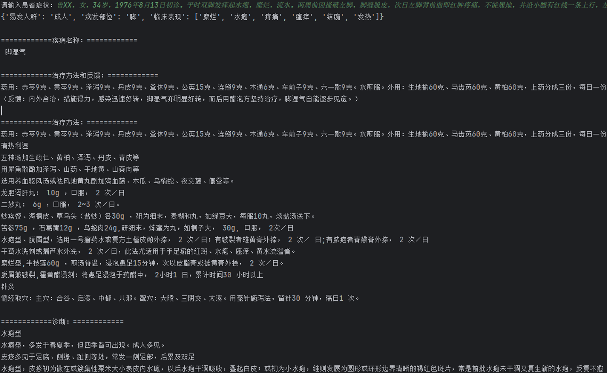

# TCMdermatosis-Graph
这个仓库包含了一个真菌性中医皮肤病知识图谱及辅助诊断系统的项目。

## 结果展示：

运行系统图

知识图谱

## 文件清单及其说明：

### data
  - Zhenjun.json：记录疾病信息的数据文件
  - MedicalRecord.json：病例例子
  - 1.xlsx：词典

### Code
  - 01 CreatGraph.py：用于构建知识图谱的代码
  - 02 Export.py：用于提取疾病名称和病因、临床表现、药方和治疗方法的代码
  - 03 HierarchicalClustering.py：层次聚类的代码
  - 04 AssociationRules.py：关联规则分析的代码
  - 05 Model.py：包括智能问诊、辅助诊断、治疗方案推荐的诊断系统代码
  - 06 After.py：疗效评估与反馈的代码
  > 代码运行前需要修改读取文件的路径、Neo4j数据库的账号密码以及输出结果的路径

### Result
  - 病因.jpg：病因层次聚类树状图
  - 临床表现.jpg：临床表现层次聚类树状图
  - 药方.jpg：药方层次聚类树状图
  - 治疗方法.jpg：治疗方法层次聚类树状图
  - 药方_Transposed.xlsx：用于数据分析的表格
  - 临床表现_Transposed.xlsx：用于数据分析的表格
  - 药方_Transposed.xlsx：用于数据分析的表格
  - 治疗方法_Transposed.xlsx：用于数据分析的表格
